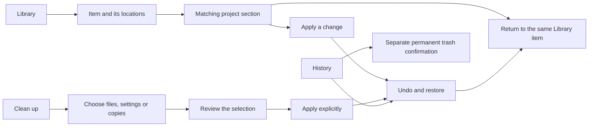

# Plan: a complete, approachable management workflow

Status: **shipped in `36d3de9`** — fixture-verified on Windows; no owner acceptance is recorded.
Its navigation decision is [ADR-0012](../adr/0012-organize-navigation-around-user-tasks.md); the Flat File
look it kept was later replaced by [Signal themes](2026-09-06-signal-themes.md).

Keep the existing Flat File visual identity while making discovery, project
management, cleanup and recovery understandable without knowing Claude Code's
storage formats. This follows the usability review; its pending roadmap
acceptance and backend release blockers remain separate.

## Scope

- Renderer: start in Library; four primary destinations with purpose labels.
  Put settings leftovers and duplicate skills inside Clean up.
- Library: explain categories, show meaningful locations before technical
  metadata, place management links near the item heading, and return to the
  same item/filter after managing it in a project.
- Projects: an overview followed by focused Skills, Plugins, Connections,
  Tools, Conversations and Technical details sections. Explain global vs
  project scope; reset pending operations when switching projects.
- Cleanup: choose, review, move to trash, then undo. Explain that moving bytes
  to trash does not release disk space until the trash is emptied. Keep every
  selection explicit and the irreversible trash operation separate.
- Layout and interaction: at the minimum 900 x 600 window, show a usable
  browser or detail pane instead of squeezing three columns. Preserve native
  keyboard behavior and move focus when its originating control disappears.
- Documentation: update DESIGN, vocabulary, user-facing navigation references,
  architecture notes and the changelog with the implemented workflow.

## Out of scope

New store adapters, permissions or mutation capabilities; release-blocking
backend findings recorded in the previous review; real-store mutation;
rebranding, localization, onboarding accounts or network services.

## Decisions

| # | Decision | Rationale |
|---|---|---|
| 1 | Library is the initial destination. | Find a named skill or plugin without first knowing its project. |
| 2 | Four destinations: Library, Projects, Clean up, History. | Reflect user goals; cleanup subviews distinguish the different operations. |
| 3 | Keep warm surfaces, Plex fonts, flat rules and established status colors. | Preserve the identity the owner likes while changing hierarchy and flow. |
| 4 | Use native buttons, select controls and details disclosures. | Avoid introducing incomplete custom tab or menu keyboard patterns. |
| 5 | Paths, hashes and raw settings are optional detail; errors remain visible. | Reduce reading burden without hiding uncertainty or refusals. |
| 6 | Project and Library selection live in App; confirmations belong to their mounted scope. | Returning should preserve context; changing scope must never carry a stale confirmation. |
| 7 | Explain configured state separately from runtime availability. | Kondo reads local data and cannot establish that a server is connected. |

## Seam changes

None. Continue using the typed bridge and opaque entity/project IDs. All
development and test writes target synthetic fixture roots only.

## Tests

- Launch Electron with all fixture root overrides. Assert Library starts
  selected and exactly four destinations are present.
- Browse a skill, open the matching project section, return, and verify the
  selection and search survive; verify meaningful focus after transitions.
- At 900 x 600, inspect browser/detail/confirmation geometry and screenshots;
  assert no horizontal document overflow and usable visible controls.
- Exercise native keyboard navigation/disclosures and confirmation Escape.
  Cancellation must leave journal/settings bytes unchanged.
- Apply one fixture-backed change through visible controls, undo it, and
  verify restoration and accessible result feedback.
- Check all cleanup subviews, partial-read feedback and separate permanent
  deletion confirmation. Run unit tests, typecheck, lint, guards and build.

## Done when

A person can find a skill, understand where it is available, manage it in the
correct project, undo the change and return to the same Library item. Cleanup
has an explicit review step and understandable consequences. The workflow is
usable with keyboard and at the minimum window size, with fixture evidence.

## Implemented workflow

The Library overview explains each category in flat rows. Search and a native
type selector lead to item details; management links appear immediately below
the heading. Missing plugin installations lead to Settings leftovers instead
of an empty management page. Global is explained as All projects.

Project overview and category sections replace the single long inventory.
The current project is excluded from move destinations. Closing a project or
switching contexts discards staged confirmations. Immediate Undo refreshes
both the detail and the project list. Cleanup retains Undo when a partial
operation returns a journal entry together with errors.

Library and Projects switch from split panes to browser/detail navigation
below 1180px. Back restores the Library row and filters. Resize, clear-filter
and mutation-result transitions leave focus on a visible, meaningful element.
The lasting navigation decision is recorded in
[ADR-0012](../adr/0012-organize-navigation-around-user-tasks.md).

## Validation, 2026-09-06

- `npm test`: **364 passed** across 32 files.
- `npm run typecheck`, `npm run lint`, `npm run build`: passed.
- Built Electron on Windows: **13/13 e2e scenarios passed**, including
  Tab/Enter/Space navigation, native disclosures, resize focus, all cleanup
  sections, Library/project return, and 900x600 geometry checks.
- The visible cleanup workflow moved two fixture directories to trash and
  restored their exact saved bytes with Undo. The synthetic project working
  tree remained byte-for-byte unchanged. Cancellation left settings and
  journal bytes unchanged; damaged-history and partial-read cases still pass.
- Visual review covered Library overview, narrow browser/detail/return,
  project Skills, staged move, file/settings cleanup review, applied/restored
  results and permanent trash confirmation. Captures were emitted through
  `KONDO_E2E_SHOTS`; no screenshots contain real user stores.

The fixture run used port 9448 and closed its own Electron process afterwards.
No real store was mutated or used by tests. This validates the Windows workflow;
screen-reader testing and usability sessions with new users remain separate
evidence, as do the backend release blockers in the preceding review.
